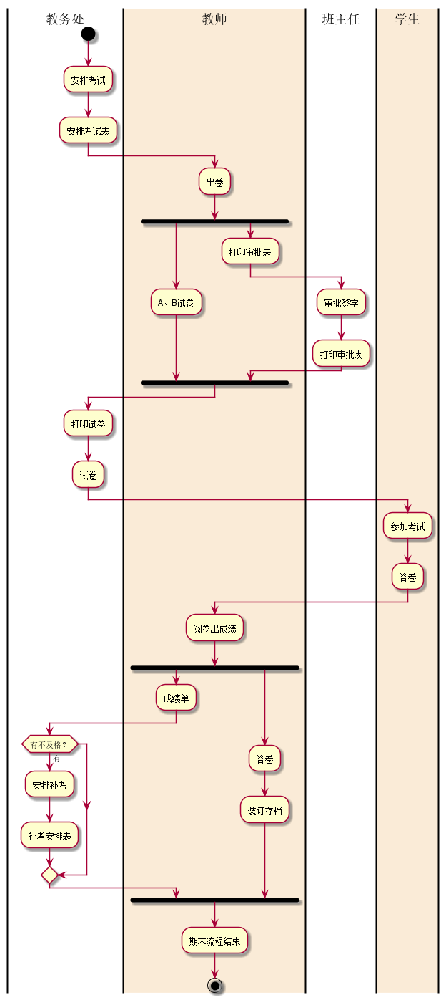

# 实验一：业务流程建模
### 流程图1：考试即成绩管理流程
PlantUML源码如下：
```
@startuml
|教务处|
start
:安排考试;
:安排考试表;
|#AntiqueWhite|教师|
:出卷;
fork
    :A、B试卷;
fork again
    :打印审批表;
        |班主任|
    :审批签字;
    :打印审批表;
end fork
|教务处|
:打印试卷;
:试卷;
|#AntiqueWhite|学生|
:参加考试;
:答卷;
|教师|
:阅卷出成绩;
fork
    :成绩单;
    |教务处|
    if(有不及格？)then(有)
        :安排补考;
        :补考安排表;
    endif
fork again
|教师|
:答卷;
:装订存档;
endfork
:期末流程结束;
stop
@enduml
```
业务流程图如下：



流程说明：
   
> 开始由教务处安排全校课程的考试，下发考试安排表。在由教师出卷，各任教师准备好A、B
卷，填写试卷打印审批表一并交于系主任审批签字，将将选中的期末试卷和已签字的试卷打印审批表送
交教务处印刷部门进行印刷。学生按时到达指定考场参加考试，考试完毕任课教师进行阅卷，产出成绩
单，并对学生答卷装订存档。如成绩有不及格情况，教务处负责安排补考时间和地点，产生补考安排表，
期末流程结束。

### 流程图2： 客户维修服务流程
PlantUML源码如下：
```
@startuml
|客户|
start
:申请服务;
|#AntiqueWhite|业务经理|
    if(是新客户吗？)then(是)
        :登记客户信息;
    else(不是)
    endif
        :上门勘察;
        :制定方案;
|客户|
 if(满意吗？)then(否)
    stop
 else(是)
    :签订服务合同;
     |业务经理|
        fork
            :安排工人;
         forkagain
            :安排材料;
        endfork
        :填写派工单;
     |工人|
     :领取材料;
     :上门服务;
     |客户|
     :验收并填写反馈意见;
     |业务经理|
     :交回派工单;
     |#AntiqueWhite|财务人员|
     :结束收款;
endif
stop
@enduml
```
业务流程图如下:


流程说明： 

>流程从客户申请服务开始,如果是新客户，业务经理将该客户的基本信息记录下来。接下来
业务经理将上门进行勘察，并制定具体“维修方案”。业务经理和客户就方案进行沟通，如果达成致，则
签订正式“服务合同”,否则流程终结。根据合同方案，业务经理将对实施维修的人员和所需材料进行
计划,并填发“派工单”。工人拿到派工单后.领取指定材料上门实施服务。服务完成后客户进行验收,
并在“派工单”上填写维修信息和反馈意见，业务经理收回派工单后，通知财务人员进行项目的结算
并收教。客户维修服务流程结束。