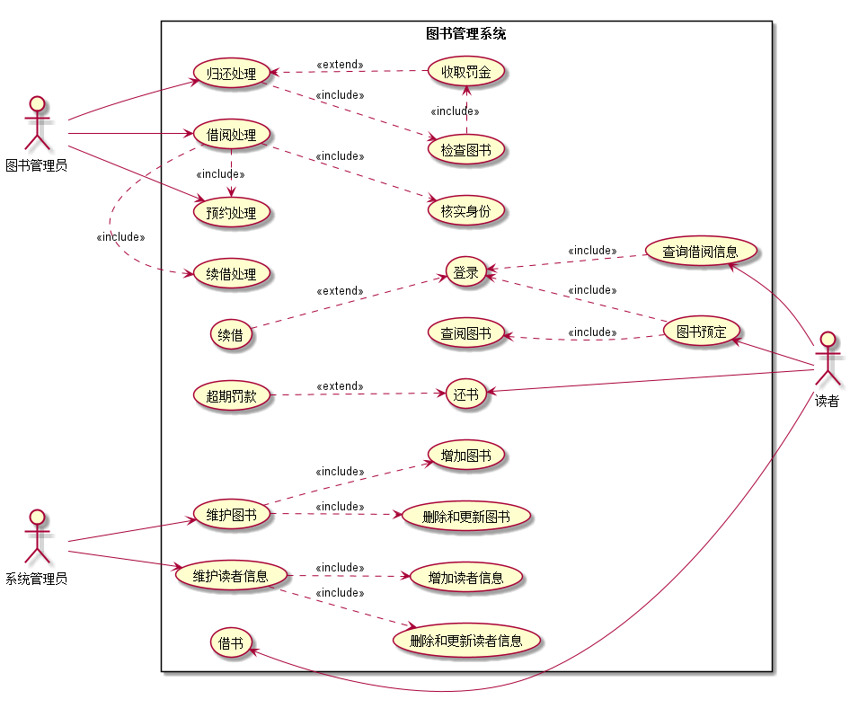

# 实验2：图书管理系统用例建模
## 1. 图书管理系统的用例关系图

### 1.1 用例图PlantUML源码如下：

``` usecase
@startuml
:图书管理员:as Lib
:读者:as Bor
:系统管理员:as Adm
left to right direction
rectangle 图书管理系统{
Lib -> (归还处理)
(归还处理)..>(检查图书):<<include>>
(检查图书).>(收取罚金):<<include>>
(收取罚金).>(归还处理):<< extend >>
Lib -> (借阅处理)
(续借处理)<.(借阅处理):<<include>>
(借阅处理)..>(核实身份):<<include>>
Lib --> (预约处理)
(借阅处理).>(预约处理):<<include>>
(借书)<-Bor
(还书)<-Bor
(超期罚款)..>(还书):<<extend>>
(图书预定)<--Bor
(查阅图书)<..(图书预定):<<include>>
(登录)<..(图书预定):<<include>>
(续借)..>(登录):<<extend>>
(查询借阅信息)<-Bor
(登录)<..(查询借阅信息):<<include>>

Adm --> (维护读者信息)
(维护读者信息)..>(增加读者信息):<<include>>
(维护读者信息)..>(删除和更新读者信息):<<include>>
Adm --> (维护图书)
(维护图书)..>(增加图书):<<include>>
(维护图书)..>(删除和更新图书):<<include>>
}
@enduml
```
### 1.2. 用例图如下：



## 2. 参与者说明：

###     2.1 图书管理员

    主要职责：
    归还处理：读者归还图书后，图书管理员首先需要检查图书，看图书是否损坏，如果有损坏，则收取相应的罚金，
              并完成归还处理，如无损坏，则直接完成归还处理。
    借阅处理：当读者想要借阅图书时，图书管理员首先需要对读者进行身份核实，并查看该书是否可以被借阅，如果
              可以借阅，则借出给读者。如果读者是想要续借图书，则图书管理员执行续借处理
    预约处理：如果读者想提前在网上预约图书的借阅，则图书管理进行预约处理，并且预约处理是包含于借阅借阅处理的。
###     2.2 读者

    主要职责：
    借书
    图书预定与查询借阅信息：读者首先登录系统，然后可以查询图书的借阅信息、预定图书或者续借图书，当然图书的预订
        还需要查阅该图书目前是否支持借阅。
    最后读者还书：如果超过了借书的期限，则需要交一定罚款

###     2.3 系统管理员
    
    主要职责：
    维护图书：可以增加、删除、更新图书
    维护读者信息：可以查看读者信息，增加、删除、更新读者的信息

##     3. 用例规约表

###     3.11 “借阅处理”用例

<table style="width:100%;" cellpadding="2" cellspacing="0" border="1" bordercolor="#000000">
	<tbody>
		<tr>
			<td>
				用例名称
			</td>
			<td>
				借阅处理
			</td>
		</tr>
		<tr>
			<td>
				参与者
			</td>
			<td>
				图书管理员（主要参与者）、读者（次要参与者）
			</td>
		</tr>
		<tr>
			<td>
				前置条件
			</td>
			<td>
				图书管理员已被识别和授权，并且核实了读者身份
			</td>
		</tr>
		<tr>
			<td>
				后置条件
			</td>
			<td>
				存储借书记录，更新库存数量，所借图书状态为借出
			</td>
		</tr>
		<tr>
			<td>
				主事件流
			</td>
			<td>
				<p>
					1、图书管理员将读者借书卡提供给系统；
				</p>
				<p>
					2、系统验证读者身份和借书条件；
				</p>
				<p>
					3、图书管理员将读者所借图书输入系统；
				</p>
				<p>
					4、系统记录借书信息，并且修改图书的状态和此书种的可借数量；
				</p>
				<p>
					5、系统累加读者的借书数量；
				</p>
				<p>
					6、重复3~5，直到图书管理员确认全部图书登记完毕；
				</p>
				<p>
					7、系统打印借书清单，交易成功完成；
				</p>
			</td>
		</tr>
		<tr>
			<td>
				备注
			</td>
			<td>
				图书馆开架借阅，读者找到书后办理借阅手续，因此借书不需要验证库存，而且每本书都是可识别的
			</td>
		</tr>
		<tr>
			<td>
				备选事件流
			</td>
			<td>
				<p>
					2a、非法读者
				</p>
				<p>
					&nbsp; &nbsp; 1.系统提示错误并拒绝接受输入
				</p>
				<p>
					2b、读者借书数已达限额
				</p>
				<p>
					&nbsp; &nbsp; 1、<span>系统提示错误并拒绝接受输入</span>
				</p>
				<p>
					<span>2c、之前产生的罚款未交</span>
				</p>
				<p>
					<span>&nbsp; &nbsp; 1、系统提示应当立即缴纳罚款并拒绝接受输入<br />
</span>
				</p>
				<p>
					5a、读者借书数已达限额
				</p>
				<p>
					&nbsp;&nbsp;&nbsp;&nbsp;<span>1、</span><span>系统提示，并要求结束输入</span>
				</p>
				<p>
					&nbsp;&nbsp;&nbsp;&nbsp;2、图书管理员确认借书完成
				</p>
				<p>
					5b、读者有该书目的预订记录
				</p>
				<p>
					&nbsp; &nbsp; 1、删除该书的预订信息
				</p>
			</td>
		</tr>
		<tr>
			<td>
				<p>
					非功能性需求
				</p>
			</td>
			<td>
				<p>
					1、图书使用条码识别技术进行登记
				</p>
				<p>
					2、支持多种语言显示（外文书籍包括德文、日文、西班牙文）
				</p>
			</td>
		</tr>
	</tbody>
</table>
<br />

###     3.12 “归还处理”用例

<table style="width:100%;" cellpadding="2" cellspacing="0" border="1" bordercolor="#000000">
	<tbody>
		<tr>
			<td>
				用例名称
			</td>
			<td>
				归还处理
			</td>
		</tr>
		<tr>
			<td>
				参与者
			</td>
			<td>
				图书管理员（主要参与者）、读者（次要参与者）
			</td>
		</tr>
		<tr>
			<td>
				假设
			</td>
			<td>
				因为每本书都是可识别的，所以还书不需要验证读者
			</td>
		</tr>
		<tr>
			<td>
				前置条件
			</td>
			<td>
				图书管理员已被识别和授权
			</td>
		</tr>
		<tr>
			<td>
				后置条件
			</td>
			<td>
				存储借书记录，更新库存数量，所借图书状态为可借
			</td>
		</tr>
		<tr>
			<td>
				主事件流
			</td>
			<td>
				<p>
					1、图书管理员将图书提供给系统；
				</p>
				<p>
					2、系统根据借书记录验证图书信息；
				</p>
				<p>
					3、统提供借阅该书的读者信息；
				</p>
				<p>
					4、系统修改借书记录，更新该书的状态及此种书的可借数量；
				</p>
				<p>
					5、图书管理员重复步骤1，直到退出；
				</p>
			</td>
		</tr>
		<tr>
			<td>
				备选事件流
			</td>
			<td>
				<p>
					1a、图书有损坏
				</p>
				<p>
					&nbsp; &nbsp; 1.图书管理员提示读者缴纳相应的罚金
				</p>
				<p>
                	&nbsp;&nbsp;&nbsp;&nbsp;2、图书管理员确认还书完成
                </p>
			</td>
		</tr>
	</tbody>
</table>
<br />

###     3.13 “预约处理”用例

<table style="width:100%;" cellpadding="2" cellspacing="0" border="1" bordercolor="#000000">
		<tbody>
			<tr>
				<td>
					用例名称
				</td>
				<td>
					预约处理
				</td>
			</tr>
			<tr>
				<td>
					参与者
				</td>
				<td>
					图书管理员（主要参与者）、读者（次要参与者）<br />
				</td>
			</tr>
			<tr>
				<td>
					前置条件
				</td>
				<td>
					图书管理员已被识别与授权，读者满足借阅条件
				</td>
			</tr>
			<tr>
				<td>
					后置条件
				</td>
				<td>
					存储预约记录，更新库存数量，所借图书状态为已被预定
				</td>
			</tr>
			<tr>
				<td>
					主事件流
				</td>
				<td>
					<p>
						1、图书管理员将读者提供的预约信息提供给系统；
					</p>
					<p>
						2、系统验证读者身份与预约条件；&nbsp;
					</p>
					<p>
						3、系统记录读者图书预约信息，并修改图书的状态和此种书的可借（可预约）数量；
					</p>
					<p>
						4、系统累加读者的借书（预约）数量；
					</p>
					<p>
						5、图书管理员重复步骤1，直到预约处理完成；
					</p>
				</td>
			</tr>
			<tr>
				<td>
					备选事件流
				</td>
				<td>
					<p>
						2a、非法读者预约
					</p>
					<p>
						&nbsp; &nbsp; 1、系统提示错误，并拒绝该读者预约
					</p>
					<p>
						2b、读者预约书数已达限额
					</p>
					<p>
						&nbsp; &nbsp; 1、系统提示预约书数已达限额，请先完成还书，并要求结束输入&nbsp;
					</p>
					<p>
						&nbsp; &nbsp; 2、图书管理员确认预约处理完成
					</p>
				</td>
			</tr>
		</tbody>
</table>

###     3.21 “查阅借阅信息”用例
<table style="width:100%;" cellpadding="2" cellspacing="0" border="1" bordercolor="#000000">
		<tbody>
			<tr>
				<td>
					用例名称
				</td>
				<td>
					查阅借阅信息
				</td>
			</tr>
			<tr>
				<td>
					参与者
				</td>
				<td>
					读者<br />
				</td>
			</tr>
			<tr>
				<td>
					前置条件
				</td>
				<td>
					读者登录到图书管理系统
				</td>
			</tr>
			<tr>
				<td>
					后置条件
				</td>
				<td>
					无
				</td>
			</tr>
			<tr>
				<td>
					主事件流
				</td>
				<td>
					<p>
						1、读者通过自己的身份账号登录到图书管理系统；
					</p>
					<p>
						2、点击查阅借阅信息；
					</p>
					<p>
						3、查阅自己的借阅信息；
					</p>
				</td>
			</tr>
			<tr>
				<td>
					备选事件流
				</td>
				<td>
					<p>
						1a、非法读者登录
					</p>
					<p>
						&nbsp; &nbsp; 1、系统提示错误，并拒绝该读者登录
					</p>
				</td>
			</tr>
		</tbody>
</table>

###     3.22 “图书预定”用例

<table style="width:100%;" cellpadding="2" cellspacing="0" border="1" bordercolor="#000000">
		<tbody>
			<tr>
				<td>
					用例名称
				</td>
				<td>
					图书预定
				</td>
			</tr>
			<tr>
				<td>
					参与者
				</td>
				<td>
					读者（主要参与者）、图书管理员（次要参与者）<br />
				</td>
			</tr>
			<tr>
				<td>
					前置条件
				</td>
				<td>
					读者登录到图书管理系统，图书管理员身份已被识别和授权
				</td>
			</tr>
			<tr>
				<td>
					后置条件
				</td>
				<td>
					系统显示图书预定成功<br />
				</td>
			</tr>
			<tr>
				<td>
					主事件流
				</td>
				<td>
					<p>
						1、读者通过自己的身份账号登录到图书管理系统；
					</p>
					<p>
						2、读者预约自己想借阅的图书；
					</p>
					<p>
						3、系统验证读者身份与预约条件；&nbsp;<br />
                        4、系统记录读者图书预约信息，并修改图书的状态和此种书的可借（可预约）数量；<br />
                        5、系统累加读者的借书（预约）数量；<br />
                        6、读者重复步骤2，直到图书预定成功；
					</p>
				</td>
			</tr>
			<tr>
				<td>
					备选事件流
				</td>
				<td>
					<p>
						1a、非法读者登录
					</p>
					<p>
						&nbsp; &nbsp; 1、系统提示错误，并拒绝该读者登录
					</p>
					<p>
						3a、预约条件不满足
					</p>
					<p>
						&nbsp; &nbsp; 1、系统提示不满足预约条件，并拒绝该读者预约
					</p>
				</td>
			</tr>
		</tbody>
</table>


###     3.23 “借书”用例

<table style="width:100%;" cellpadding="2" cellspacing="0" border="1" bordercolor="#000000">
		<tbody>
			<tr>
				<td>
					用例名称
				</td>
				<td>
					借书
				</td>
			</tr>
			<tr>
				<td>
					参与者
				</td>
				<td>
					读者（主要参与者）、图书管理员（次要参与者）<br />
				</td>
			</tr>
			<tr>
				<td>
					前置条件
				</td>
				<td>
					读者身份已核实，图书管理员身份已被识别和授权
				</td>
			</tr>
			<tr>
				<td>
					后置条件
				</td>
				<td>
					读者拿到所借图书
				</td>
			</tr>
			<tr>
				<td>
					主事件流
				</td>
				<td>
					<p>
						1、读者找到自己想要借阅的图书；
					</p>
					<p>
						2、读者将图书与自己的借书卡提供给图书管理员；
					</p>
					<p>
						3、图书管理员完成借阅处理；&nbsp;<br />
                        4、图书管理员将图书与借书卡拿给读者，借书完成；
					</p>
				</td>
			</tr>
			<tr>
				<td>
					备选事件流
				</td>
				<td>
					<p>
						2a、没有借书卡
					</p>
					<p>
						&nbsp; &nbsp; 1、图书管理员告知读者无借书卡无法借阅该图书
					</p>
					<p>
						3a、借阅不满足（借阅书籍数已达限额）
					</p>
					<p>
						&nbsp; &nbsp; 1、图书管理员提示不满足借阅条件，并拒绝该读者借阅
					</p>
				</td>
			</tr>
		</tbody>
</table>


###     3.24 “还书”用例

<table style="width:100%;" cellpadding="2" cellspacing="0" border="1" bordercolor="#000000">
		<tbody>
			<tr>
				<td>
					用例名称
				</td>
				<td>
					还书
				</td>
			</tr>
			<tr>
				<td>
					参与者
				</td>
				<td>
					读者（主要参与者）、图书管理员（次要参与者）<br />
				</td>
			</tr>
			<tr>
				<td>
					假设
				</td>
				<td>
					因为每本书都是可识别的，所以还书不需要验证读者<br />
				</td>
			</tr>
			<tr>
				<td>
					前置条件
				</td>
				<td>
					图书管理员身份已被识别和授权
				</td>
			</tr>
			<tr>
				<td>
					后置条件
				</td>
				<td>
					读者归还图书
				</td>
			</tr>
			<tr>
				<td>
					主事件流
				</td>
				<td>
					<p>
						1、读者将自己所还图书交给图书管理员；
					</p>
					<p>
						2、图书管理员完成归还处理；
					</p>
					<p>
						3、 还书完成；
					</p>
				</td>
			</tr>
		</tbody>
</table>


###     3.31 “维护图书”用例

<table style="width:100%;" cellpadding="2" cellspacing="0" border="1" bordercolor="#000000">
		<tbody>
			<tr>
				<td>
					用例名称
				</td>
				<td>
					维护图书
				</td>
			</tr>
			<tr>
				<td>
					参与者
				</td>
				<td>
					系统管理员<br />
				</td>
			</tr>
			<tr>
				<td>
					前置条件
				</td>
				<td>
					系统管理员身份已被识别和授权
				</td>
			</tr>
			<tr>
				<td>
					后置条件
				</td>
				<td>
					完成了图书的维护
				</td>
			</tr>
			<tr>
				<td>
					主事件流
				</td>
				<td>
					<p>
						1、系统管理员对图书进行增、删、该操作；
					</p>
					<p>
						2、系统增加、删除、修改图书的相关内容；
					</p>
					<p>
						3、 维护图书完成；
					</p>
				</td>
			</tr>
		</tbody>
</table>

###     3.32 “维护读者信息”用例

<table style="width:100%;" cellpadding="2" cellspacing="0" border="1" bordercolor="#000000">
		<tbody>
			<tr>
				<td>
					用例名称
				</td>
				<td>
					维护读者信息
				</td>
			</tr>
			<tr>
				<td>
					参与者
				</td>
				<td>
					系统管理员<br />
				</td>
			</tr>
			<tr>
				<td>
					前置条件
				</td>
				<td>
					系统管理员身份已被识别和授权
				</td>
			</tr>
			<tr>
				<td>
					后置条件
				</td>
				<td>
					完成了对读者信息的维护
				</td>
			</tr>
			<tr>
				<td>
					主事件流
				</td>
				<td>
					<p>
						1、系统管理员对读者的相关信息进行增、删、改操作；
					</p>
					<p>
						2、系统增加、删除、修改读者的相关内容；
					</p>
					<p>
						3、 维护读者信息完成；
					</p>
				</td>
			</tr>
		</tbody>
</table>

