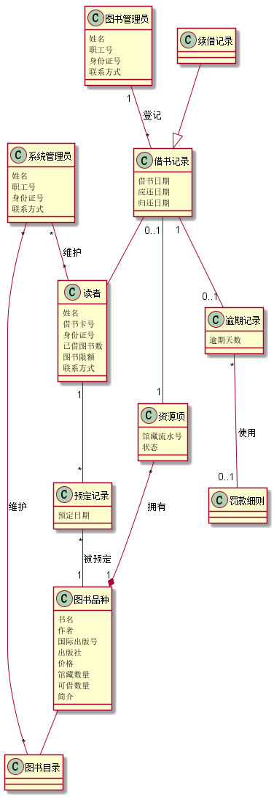
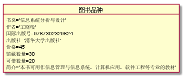
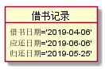
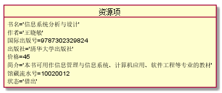
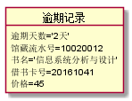
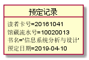

# 实验3：图书管理系统领域对象建模

## 1. 图书管理系统的类图

### 1.1 类图PlantUML源码如下：

``` class
@startuml

class 读者{
    姓名
    借书卡号
    身份证号
    已借图书数
    图书限额
    联系方式
}
class 图书管理员{
    姓名
    职工号
    身份证号
    联系方式
}
class 系统管理员{
    姓名
    职工号
    身份证号
    联系方式
}
class 借书记录{
    借书日期
    应还日期
    归还日期
}
class 逾期记录{
    逾期天数
}
class 罚款细则{

}
class 预定记录{
预定日期
}
class 续借记录{

}
class 资源项{
    馆藏流水号
    状态
}
class 图书品种{
    书名
    作者
    国际出版号
    出版社
    价格
    馆藏数量
    可借数量
    简介
}
class 图书目录{
}
图书管理员"1"--"*"借书记录:登记
借书记录"1"--"0..1"逾期记录
逾期记录"*"--"0..1"罚款细则:使用
借书记录"0..1"--"1"资源项
资源项"*"--*"1"图书品种:拥有
借书记录--读者
读者"1"--"*"预定记录
预定记录"*"--"1"图书品种:被预定
图书品种--图书目录
系统管理员"*"--"*"读者:维护
系统管理员"*"--"*"图书目录:维护
续借记录--|>借书记录
@enduml
```

### 1.2. 类图如下：



### 1.3. 类图说明：
    读者：由维护读者信息用例产生，被查询借阅信息、图书预定、借书和还书用例引用。其属性有姓名、借书卡号、身份证号、已借图书数、
        图书限额和联系方式
    借书记录：由借阅处理（借书）用例产生，被收取罚金、归还处理、借书与还书用例所引用。属性有借书日期、应还日期、归还日期、书名、
        馆藏流水号、借书卡号
    续借记录：由续借处理产生，被续借处理引用，并且续借记录是继承于借书记录，他们具有相同的服务，续借记录需修改借书记录中属性
        的值，且他的属性与借书记录相同
    逾期记录：由归还用例产生，通过使用相关的罚款细则收取罚金，所以被收取罚金用例引用，其属性为逾期天数、书名、馆藏流水号、借书
        卡号、价格
    预定记录：由预约处理（图书预定）产生，被借书与借书处理用例所引用。读者预约某图书，然后图书管理进行预约处理，最后用于借书与
        借书处理（凭借预约信息借书、借书处理），属性：读者卡号、馆藏流水号、书名、预定日期
    图书品种：由维护图书用例产生，被借阅处理与借书、还书与归还处理、图书预定与预约处理等所引用，由于是图书管理系统，所以大部分
        的用例都会用到图书品种这个类。属性：书名、作者、国际出版号、出版社、价格、馆藏数量、可借数量、简介
    图书目录：是为了方便系统管理员对图书的维护，被维护图书用例引用，且也是由维护图书用例产生。属性：与图书品种属性相同
    资源项：由维护图书用例产生，被借阅处理（借书）、归还处理（还书）、预约处理（图书预定）、查询借阅信息所引用。属性：书名、作
        者、国际出版号、出版社、价格、简介、馆藏流水号、状态
    图书管理员：被借阅处理、归还处理、预约处理用例引用。属性：姓名、职工号、身份证号、联系方式
    系统管理员：被图书维护与读者维护用例所引用。属性：姓名、职工号、身份证号、联系方式

## 2. 图书管理系统的对象图
### 2.1 类读者的对象图
#### 源码如下：
``` class
@startuml

object 读者 {
     姓名='李四'
    借书卡号=20161041
    身份证号=5115201999810053345
    已借图书数=0
    图书限额=5
    联系方式=13542678912
}
@enduml
``` 
#### 对象图如下：


### 2.2 类图书品种的对象图
#### 源码如下：
``` class
@startuml

object 图书品种{
    书名='信息系统分析与设计'
    作者='王晓敏'
    国际出版号=9787302329824
    出版社='清华大学出版社'
    价格=45
    馆藏数量=30
    可借数量=20
    简介='本书可用作信息管理与信息系统、计算机应用、软件工程等专业的教材'
    }
@enduml
``` 
#### 对象图如下：



### 2.3 类借书记录的对象图
#### 源码如下：
``` class
@startuml
object 借书记录{
    借书日期='2019-04-06'
    应还日期='2019-06-06'
    归还日期='2019-05-25'
    书名='信息系统分析与设计'
    馆藏流水号=10020012
    借书卡号=20161041
}
@enduml
``` 
#### 对象图如下：


### 2.4 类资源项的对象图
#### 源码如下：
``` class
@startuml
object 资源项{
书名='信息系统分析与设计'
作者='王晓敏'
国际出版号=9787302329824
出版社='清华大学出版社'
价格=45
简介='本书可用作信息管理与信息系统、计算机应用、软件工程等专业的教材'
馆藏流水号=10020012
状态='借出'
}
@enduml
``` 
#### 对象图如下：


### 2.5 类逾期记录的对象图
#### 源码如下：
``` class
@startuml
object 逾期记录{
逾期天数='2天'
馆藏流水号=10020012
书名='信息系统分析与设计'
借书卡号=20161041
价格=45
}
@enduml
``` 
#### 对象图如下：

### 2.6 类预定记录的对象图
#### 源码如下：
``` class
@startuml
object 预定记录{
读者卡号=20161041
馆藏流水号=10020013
书名='信息系统分析与设计'
预定日期=2019-04-10
}
@enduml
``` 
#### 对象图如下：
