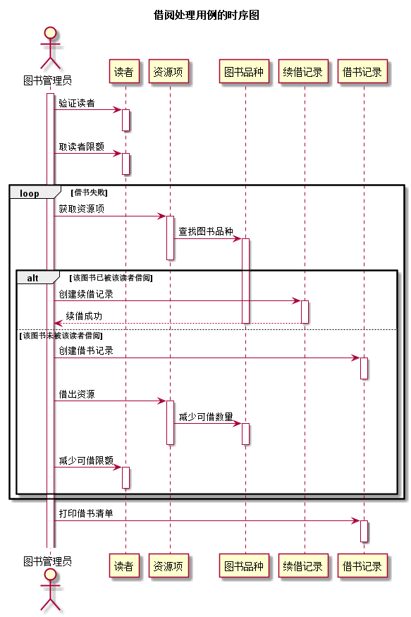

# 实验4：图书管理系统顺序图绘制
## 图书管理系统的顺序图

## 1. 借阅处理用例
## 1.1. 借阅处理用例PlantUML源码

``` sequence
@startuml
title 借阅处理用例的时序图
actor 图书管理员
activate 图书管理员
图书管理员->读者:验证读者
activate 读者
deactivate 读者
图书管理员->读者:取读者限额
activate 读者
deactivate 读者
loop 借书失败
图书管理员->资源项:获取资源项
activate 资源项
资源项->图书品种:查找图书品种
activate 图书品种
deactivate 资源项
alt 该图书已被该读者借阅
图书管理员->续借记录:创建续借记录
activate 续借记录
续借记录-->图书管理员:续借成功
deactivate 续借记录
else 该图书未被该读者借阅
deactivate 图书品种
图书管理员->借书记录:创建借书记录
activate 借书记录
deactivate 借书记录
图书管理员->资源项:借出资源
activate 资源项
资源项->图书品种:减少可借数量
activate 图书品种
deactivate 资源项
deactivate 图书品种
图书管理员->读者:减少可借限额
activate 读者
deactivate 读者
end
end
图书管理员->借书记录:打印借书清单
activate 借书记录
deactivate 借书记录
@enduml
```

## 1.2. 借阅处理用例顺序图


## 1.3. 借阅处理用例顺序图说明
    1、图书管理员验证读者的身份
    2、图书管理员取读者限额
    3、取资源项，查找图书品种
    4、如果该图书已被该读者借阅，则由图书管理员执行续借操作即创建续借记录，由于续借记录继承于技术记录，只添加一个续借图书的时间即
       可，返回续借成功
    5、如果该图书未被该读者借阅，则由图书管理员创建借书记录
    6、由图书管理员借出该资源（修改该资源的借阅状态为借出），并减少可借数量
    7、图书管理员减少读者的可借限额
    8、如果借书失败，则重复3-7步骤，直到完成借出操作
    9、打印借书清单

***

## 2. 还书处理用例
## 2.1. 还书处理用例PlantUML源码

``` sequence
@startuml
title 还书处理用例的时序图
actor 图书管理员
activate 图书管理员
图书管理员->资源项:读取资源信息
activate 资源项
资源项->借书记录:取借书记录
activate 借书记录
deactivate 借书记录
资源项->图书品种:取图书品种
activate 图书品种
deactivate 图书品种
deactivate 资源项
图书管理员->读者:取借阅者信息
activate 读者
deactivate 读者
图书管理员->资源项:检查图书
activate 资源项
deactivate 资源项
loop 归还失败
alt 图书完好
图书管理员->资源项:归还资源
activate 资源项
资源项->图书品种:增加可借数量
activate 图书品种
deactivate 图书品种
deactivate 资源项
图书管理员->读者:增加可借限额
activate 读者
deactivate 读者
图书管理员->借书记录:登记还书日期
activate 借书记录
deactivate 借书记录
opt
图书管理员->罚款细则:登记逾期记录
activate 罚款细则
deactivate 罚款细则
else 图书损坏
图书管理员->罚款细则:使用罚款细则
activate 罚款细则
罚款细则->读者:收取罚金
activate 读者
deactivate 罚款细则
deactivate 读者
end
end
end
deactivate 图书管理员
@enduml
```

## 2.2. 还书处理用例顺序图


## 2.3. 还书处理用例顺序图说明
    1、图书管理员读取资源信息，取借书记录与图书品种
    2、根据借阅的图书取得借阅者的信息
    3、检查图书是否有损坏
    4、如果图书完好、无损坏，则归还资源，增加可借数量
    5、图书管理员增加读者的可借限额
    6、图书管理员登记读者的还书日期
    7、如果图书有损坏或者逾期归还（登记逾期记录），则根据罚款细则，收取读者相应的罚金。
    8、归还失败，则重复4-7步骤
***

## 3. 图书预定用例
## 3.1. 图书预定用例PlantUML源码

``` sequence
@startuml
title 图书预定用例的时序图
actor 读者
读者->图书管理系统 :登录
activate 读者
activate 图书管理系统
deactivate 图书管理系统
opt
读者->借书记录:查询借阅信息
activate 借书记录
return 读者的借阅信息
deactivate 借书记录
end
loop 预定失败
读者->图书目录:查找图书
activate 图书目录
return 图书信息
deactivate 图书目录
读者->预定记录:创建预定记录
activate 预定记录
deactivate 预定记录
alt 如果该图书品种有可借数量且读者未达到借书限额
图书管理系统->资源项:预定资源
activate 图书管理系统
deactivate 图书管理系统
activate 资源项
资源项->图书品种:减少可借数量
activate 图书品种
deactivate 资源项
图书品种-->读者:预定成功
deactivate 图书品种
else 该图书无可借数量或读者已达到借书限额
图书管理系统-->读者:预定失败
end
opt
读者->预定记录:取消预订记录
activate 预定记录
deactivate 预定记录
end
end
deactivate 读者
@enduml
```
## 3.2. 图书预定用例顺序图


## 3.3. 图书预定用例顺序图说明
    1、读者登录到图书管理系统
    2、读者可以选择是否查询自己的借阅信息，返回给读者相关的借阅信息
    3、读者通过查找图书目录找到想要预定的图书，找到图书之后返回相关的图书信息
    4、创建该图书的预订记录
    5、如果该图书品种有可借数量并且读者未达到借书限额，则图书管理系统为该读者预定该资源（修改该图书的借阅状态为被预定），并减少
       可借数量
    6、返回预定成功的消息给读者
    7、如果该图书品种无可借阅数量或读者已达借书限额，则返回预定失败
    8、读者可以选择是否取消预订，如果取消预订，还是会保留预定记录，只是记录中添加了取消预订的时间
    9、如果预定失败的话，就重复2-7的操作，直到图书预定完成。
***
## 4. 维护图书用例
## 4.1. 维护图书用例PlantUML源码

``` sequence
@startuml
title 维护图书用例的时序图
actor 系统管理员
alt 该类图书已存在
activate 系统管理员
系统管理员->图书目录:查找图书
activate 图书目录
图书目录->图书品种:删除、更新图书
activate 图书品种
deactivate 图书品种
deactivate 图书目录
else 该类图书不存在
系统管理员->图书品种:增加图书品种
activate 图书品种
return 增加图书成功
deactivate 图书品种
end
deactivate 系统管理员
@enduml
```
## 4.2. 维护图书用例顺序图


## 4.3. 维护图书用例顺序图说明
    1、系统管理员维护图书，如果该类图书已近存在，则只需要通过图书目录查到到该类图书，然后进行删除、更新操作
    2、如果该类图书不存在，则需要增加该图书品种，并返回增加图书成功的消息
***
## 5.1. 维护读者信息用例PlantUML源码

``` sequence
@startuml
title 维护读者信息用例的时序图
actor 系统管理员
alt 该读者已存在
activate 系统管理员
系统管理员->读者:查找、更新、删除该读者
activate 读者
return 维护读者信息成功
deactivate 读者
else 该读者不存在
系统管理员->读者:增加读者信息
activate 读者
return 增加读者信息成功
deactivate 读者
end
deactivate 系统管理员
@enduml
```
## 5.2. 维护读者信息用例顺序图


## 5.3. 维护读者信息用例顺序图说明
    1、系统管理员维护读者，如果该读者信息已近存在，则执行查找、删除、更新操作，并返回维护读者信息成功的消息
    2、如果该读者不存在，则需要增加该读者，并返回增加读者成功的消息
***