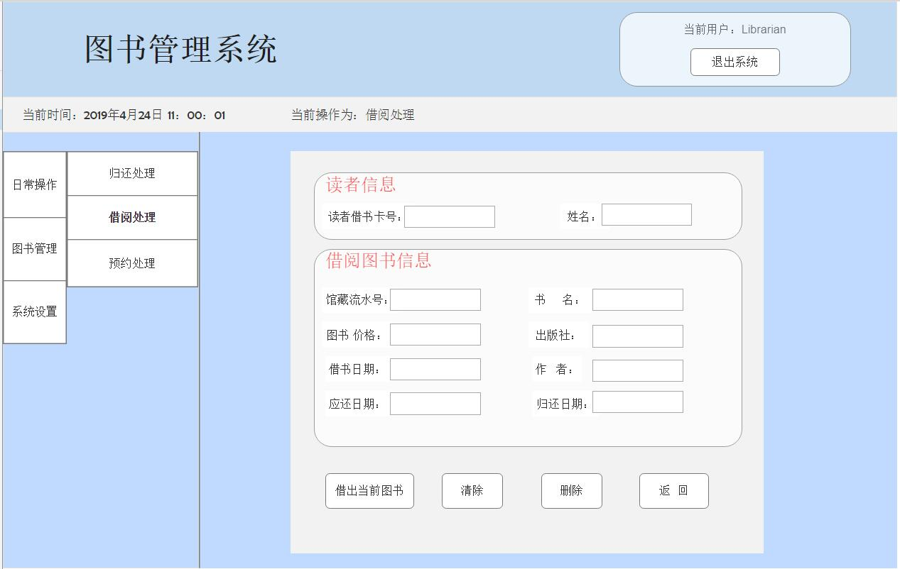

# 实验5：图书管理系统数据库设计与界面设计

## 1.数据库表设计

## 1.1. 图书品种表（Book）
|字段|类型|主键，外键|可以为空|默认值|约束|说明|
|:-------:|:-------------:|:------:|:----:|:---:|:----:|:-----|
|B_ID|varchar(20)|外键|否|||馆藏流水号，是资源项表的主键|
|B_ISBN|varchar(20)|主键|否|||国际出版号|
|B_Name|varchar(30)| |否|||图书的书名|
|B_Author|varchar(20)| |否|||图书的作者|
|B_Price|decimal(6,2)||否|||图书价格，小数位数为2|
|B_Pub|varchar(50)||是|||图书出版社|
|B_Synopsis|varchar(200)||是|||图书简介，可以为空|
|B_Avanum|int(50)||否|||图书的可借数量|
|B_Colnum|int(50)||否|||图书的馆藏数量|


## 1.2. 读者表（Read）
|字段|类型|主键，外键|可以为空|默认值|约束|说明|
|:-------:|:-------------:|:------:|:----:|:---:|:----:|:-----|
|R_ID|varchar(20)|主键|否|||读者的借书卡号|
|R_Name|varchar(20)| |否|||读者姓名|
|R_Identity|varchar(18)| |否|||读者的身份证号|
|R_Borrowednum|int(10)||是|||读者已借的图书数，如果未借得有图书，则为空|
|R_Booklimit|int(10)||否|||读者的图书限额|
|R_Contact|varchar(20)||否|||读者的联系方式|
|R_Password|varchar(20)||否|||读者的登录密码|

## 1.3. 图书管理员表（Librarian）
|字段|类型|主键，外键|可以为空|默认值|约束|说明|
|:-------:|:-------------:|:------:|:----:|:---:|:----:|:-----|
|L_ID|varchar(20)|主键|否|||图书管理员的职工号|
|L_Name|varchar(20)| |否|||图书管理员的姓名|
|L_Identity|varchar(18)| |否|||图书管理员的身份证号|
|L_Contact|varchar(20)||否|||图书管理员的联系方式|
|L_Password|varchar(20)||否|||图书管理员的登录密码|
## 1.4. 系统管理员表（system administrator）
|字段|类型|主键，外键|可以为空|默认值|约束|说明|
|:-------:|:-------------:|:------:|:----:|:---:|:----:|:-----|
|S_ID|varchar(20)|主键|否|||系统管理员的职工号|
|S_Name|varchar(20)| |否|||系统管理员的姓名|
|S_Identity|varchar(18)| |否|||系统管理员的身份证号|
|S_Contact|varchar(20)||否|||系统管理员的联系方式|
|S_Password|varchar(20)||否|||系统管理员的登录密码|

## 1.5. 借书记录表（Borrow books）
|字段|类型|主键，外键|可以为空|默认值|约束|说明|
|:-------:|:-------------:|:------:|:----:|:---:|:----:|:-----|
|Bw_ID|varchar(20)|主键|否|||借书编号|
|B_ID|varchar(20)|外键|否|||图书的馆藏流水号，资源项的主键|
|R_ID|varchar(20)|外键|否|||读者的借书卡号，读者表的主键|
|Bw_Borrowdate|date| |否|||读者借该图书的日期,借书日期不能为空|
|Bw_Returndate|date| |是|||读者借书时，归还该图书的日期可以为空|
|Bw_Duedate|date||否|||读者借阅该图书的应还日期，应该在改日期内归还图书或续借，不能为空|
## 1.6. 预约记录表（Subscribe）
|字段|类型|主键，外键|可以为空|默认值|约束|说明|
|:-------:|:-------------:|:------:|:----:|:---:|:----:|:-----|
|S_ID|varchar(20)|主键|否|||预约编号|
|B_ID|varchar(20)|外键|否|||图书的馆藏流水号，资源项的主键|
|R_ID|varchar(20)|外键|否|||读者的借书卡号，读者表的主键|
|S_Date|date| |否|||预约日期|

## 1.7. 资源项表（Resource）
|字段|类型|主键，外键|可以为空|默认值|约束|说明|
|:-------:|:-------------:|:------:|:----:|:---:|:----:|:-----|
|B_ID|varchar(20)|主键|否|||图书的馆藏流水号，是图书品种表、借书记录表的外键|
|B_State|varchar2(100)| |否|||图书的状态，是否被已借出|

## 1.8. 逾期记录表（Overdue records）
|字段|类型|主键，外键|可以为空|默认值|约束|说明|
|:-------:|:-------------:|:------:|:----:|:---:|:----:|:-----|
|O_ID|varchar(20)|主键|否|||逾期编号|
|B_ID|varchar(20)|外键|否|||图书的馆藏流水号，资源项的主键|
|R_ID|varchar(20)|外键|否|||读者的借书卡号，读者表的主键|
|O_Date|date| |否|||逾期天数|
|O_Money|decimal(6,2)||否|||逾期所产生的罚款|
***

## 2. 界面设计
## 登录界面

## 2.1. 借书界面设计

- 用例图参见：借书用例
- 类图参见：借书类，读者类
- 顺序图参见：借书顺序图
- API接口如下：

1. 获取全部分类

- 功能：用于获取全部分类
- 请求地址： http://[YOUR_DOMAIN]/v1/api/shop_cate
- 请求方法：POST
- 请求参数：

|参数名称|必填|说明|
|:-------:|:-------------: | :----------:|
|access_token|是|用于验证请求合法性的认证信息。 |
|method|是|固定为 “GET”。|

- 返回实例：
```
{
    "info": "感谢您的支持。",
    "data": {
        "nickname": "O记_Mega可达鸭",
        "uid": "14361",
        "signature": "呀  一不小心就进化了",
        "score1": "322",
        "real_nickname": "O记_Mega可达鸭",
        "title": "Lv3 转正",
        "avatar128": "http://upload.opensns.cn/Uploads_Avatar_14361_58e4b58fccf81.jpg?imageMogr2/crop/!260x260a6a22/thumbnail/128x128!",
        "avatar512": "http://upload.opensns.cn/Uploads_Avatar_14361_58e4b58fccf81.jpg?imageMogr2/crop/!260x260a6a22/thumbnail/512x512!"
    },
    "code": 200
}
```
- 返回参数说明：
    
|参数名称|说明|
|:-------:|:-------------: |
|Info|返回信息|
|data|用户的个人信息|
|dodo|返回码|

2. *******API
- 功能：用于获取全部分类
- 请求地址： http://[YOUR_DOMAIN]/v1/api/shop_cate
- 请求方法：POST
- 请求参数：

|参数名称|必填|说明|
|:-------:|:-------------: | :----------:|
|access_token|是|用于验证请求合法性的认证信息。 |
|method|是|固定为 “GET”。|

- 返回实例：
```
{
    "info": "感谢您的支持。",
    "data": {
        "nickname": "O记_Mega可达鸭",
        "uid": "14361",
        "signature": "呀  一不小心就进化了",
        "score1": "322",
        "real_nickname": "O记_Mega可达鸭",
        "title": "Lv3 转正",
        "avatar128": "http://upload.opensns.cn/Uploads_Avatar_14361_58e4b58fccf81.jpg?imageMogr2/crop/!260x260a6a22/thumbnail/128x128!",
        "avatar512": "http://upload.opensns.cn/Uploads_Avatar_14361_58e4b58fccf81.jpg?imageMogr2/crop/!260x260a6a22/thumbnail/512x512!"
    },
    "code": 200
}
```
- 返回参数说明：
    
|参数名称|说明|
|:-------:|:-------------: |
|Info|返回信息|
|data|用户的个人信息|
|dodo|返回码|


 # is_analysis
