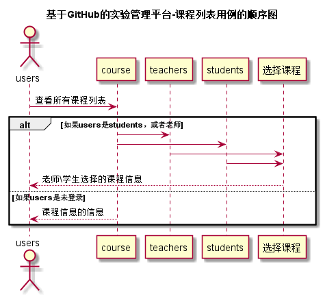

# “课程列表”用例 [返回](../README.md)
## 1. 用例规约

|用例名称|课程列表|
|-------|:-------------|
|功能|以表形式的显示出所有课程的信息|
|参与者|游客，学生，老师|
|前置条件|学生，老师需要先登录|
|后置条件|登录成功 |
|主事件流|1、学生或老师登录  2、查看所以的课程列表 3、选择课程|
|备选事件流| 1、如未登录 1a、只能查看课程信息|

## 2. 业务流程（顺序图） [源码](../src/sequence课程列表.puml)
 

## 3. 界面设计
- [界面参照]( ../界面/课程列表.md)
- API接口调用
    - 接口1：[getCourse](../接口/getCourse.md) 

## 4. 算法描述

无
    
## 5. 参照表

- [COURSE](../数据库设计.md/#COURSE)

