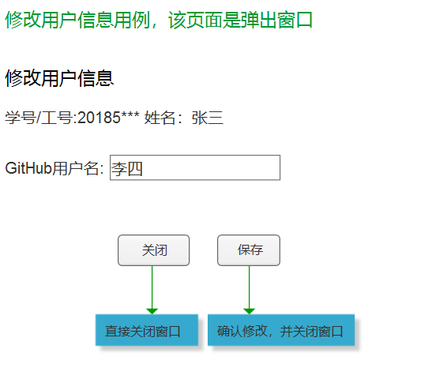

- ### GitHub用户名的接口为：[getUserInfo](https://github.com/mxbox2/is_analysis/blob/master/test6/接口/getUserInfo.md)
- ### 保存的接口为：[setUserInfo](https://github.com/mxbox2/is_analysis/blob/master/test6/接口/setUserInfo.md)