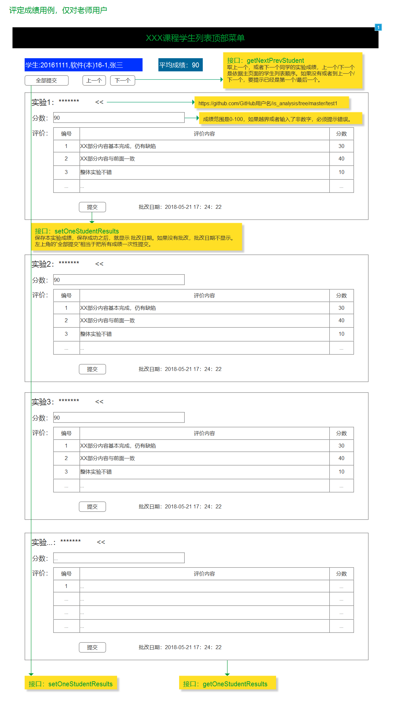

- ### 接口1：[getNextPrevStudent](../接口/getNextPrevStudent.md)
- ### 接口2：[setOneStudentResults](../接口/setOneStudentResults.md)
- ### 接口3：[setOneStudentResults](../接口/setOneStudentResults.md)
- ### 接口4：[getOneStudentResults](../接口/getOneStudentResults.md)
### 界面如下：
